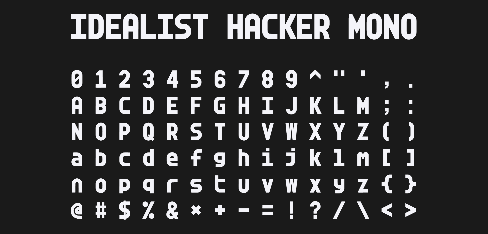
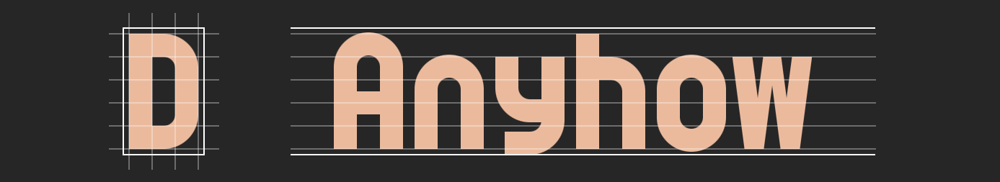

### [**Try it out!**](https://teadrinker.github.io/idealist-hacker-mono-font/test.html) 

## About
* This repo contains ready-to-use, TTF, OTF and WOFF font files. ([SIL Open Font License](https://scripts.sil.org/OFL))
* This typeface was inspired by pixel-fonts and 70s hacker culture
* Also contains hacky code to generate font from a custom svg glyph sheet
* Code requires Deno, and uses opentype.js and [svg flattener from Timo](https://gist.github.com/timo22345/9413158/)
* Each glyph is designed to fit snuggly into a box. I tried to align to a 6x10 grid with 1 unit spacing both horizontally and vertically (half a unit on all 4 sides). Most glyphs align to a 3x5 grid as well:

## Issues
 * Only ASCII characters were designed (fallbacks to [JetBrains Mono](https://www.jetbrains.com/lp/mono/) for others)
 * Converted from pixel font, so kind of looks ugly in larger sizes. I hope to look into that at some point, most of this typeface is purely geometric and would be nice if that wasn't lost in translation...
 * Some ligatures would also help some cases...

## Future
 * At some point I hope to make a proper variable-width version of this font
 * Also a monospaced variant that has more normal descenders would be nice...

## Fun links...
 * [Jgs Font](https://adelfaure.net/tools/jgs/) nice pixel fonts for ASCII art by [Adel Faure](https://adelfaure.net/)
