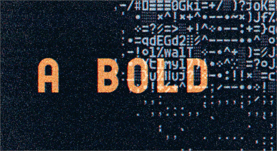
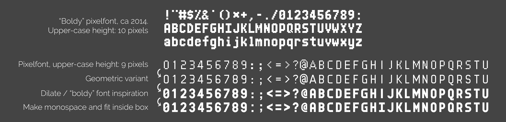

### [**Try it out!**](https://teadrinker.github.io/idealist-hacker-mono-font/test.html) 

## About
* Typeface was inspired by pixel-fonts and 70s hacker culture
* First apperead in my demo [PRINT](https://www.youtube.com/watch?v=_ggIXZhOPfs)

  

* Each glyph is designed to fit snuggly into a box. I tried to align to a 6x10 grid with 1 unit spacing both horizontally and vertically (half a unit on all 4 sides). Most glyphs align to a 3x5 grid as well:

  

* This repo contains ready-to-use web font (.woff) ([SIL Open Font License](https://scripts.sil.org/OFL))
* Also contains hacky code to generate font from a custom svg glyph sheet
* Code requires Deno, and uses opentype.js and [svg flattener from Timo](https://gist.github.com/timo22345/9413158/)

## Issues
 * Only ASCII characters were designed. Fallbacks to [JetBrains Mono](https://www.jetbrains.com/lp/mono/) (ExtraBold)
 * OTF/TTF export don't seem to work...
 * Converted from pixel font, so kind of looks ugly in larger sizes. I hope to look into that at some point, most of this typeface is purely geometric and would be nice if that wasn't lost in translation...
 * Some ligatures would also help some cases...

## Future
 * Might do another iteration on glyphs 4 e g j @ $ &
 * At some point I hope to make a proper variable-width version of this font
 * Also a monospaced variant that has more normal descenders would be nice...

## Evolution

For many years I enjoyed making pixelfonts as a kind of meditation. After trying some sizes, I felt a height of 9 pixels (for upper case characters) was nice, and I tried to make a version that was 16 times larger using circles and straight lines. Some time later I was fiddling with a bolder pixel-font with a pixel height of 10, inspired by the Atari ST font. I realized these two fonts had a connection, and that I could use dilation (plus a lot of manual work) to make a bold version of the 16x font. At the 16x level it's no longer pixeling, and I started to explore things like overshoot and trying out many variations of tricky characters. For many years I did not test what I was doing as it was just an image of glyphs. I knew multiple things I wanted to do that required a monospaced font, and also -monospaced is easy to render! So I hacked together something and started to adapt the font to fit into a tight monospaced grid. 

  

## Fun links...
 * [Jgs Font](https://adelfaure.net/tools/jgs/) nice pixel fonts for ASCII art by [Adel Faure](https://adelfaure.net/)
